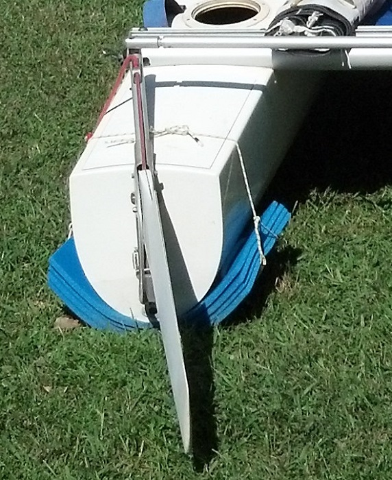
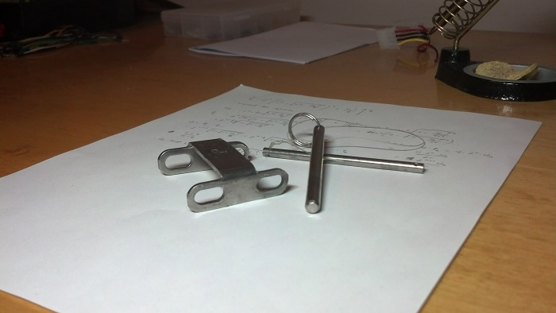

Title: Prindle 19 basics
Date: 2015-11-23 21:12
Tags: sailing
Summary: A beginner's guide to the Prindle 19 catamaran.  

I bought a Prindle 19 catamaran as my first boat.  While I was comfortable on/in the water, I hardly knew anything about sailing.  There was a lot to learn, which is what this post attempts to document.  

Maybe this will help someone else out there feel less intimidated with regards to getting into catamarans.  My advice is to ignore the racing-minded folk whose comments are always couched in terms of racing and remember one thing instead: _the basics of sailing are easy but sailing well is difficult_.  Who cares about the latter if you just want to have fun.  Know your right-of-way rules and stay out of trouble.  

Definitions
============

- __Bitter end__ - The end of a line.  
- __Block__ - Nautical term for a pulley.  
- __Bolt rope__ - The portion of the mainsail's luff that attaches to the mast.  It resembles a rope that has sailcloth wrapped around it.  
- __Bow__ - Front of the boat.  
- __Clew__ - The bottom corner of the sail that is closest to the stern.  
- __Curf__ - The mast's channel through which the mainsail's bolt rope is fed.  
- __Foot__ - The bottom of the sail.  
- __Forestay__ - Metal cabling that extends from the bow to the top of the mast.  
- __Forestay Y__ - The branching of the forestay into two cables terminating at the port/starboard bows.  
- __Halyard__ - A line that raises a sail.  
- __Head__- The top of the sail.  
- __Luff__ - The vertical edge of a raised sail that faces the bow.  
- __Mast locking hook__ - Hook at the top of the mast where the main halyard ring attaches.  
- __Port__ - Left side of the boat when standing in the middle of the boat and facing the bow.  
- __Safety position__ - When the boat is positioned so that the wind is crossing its side with the jib/mainsheet lines let out so that the sails are not powered up.  
- __Shroud__ - Metal cabling that extends from the top of the mast to either the port or starboard side of the boat.  
- __Stern__ - Rear of the boat.  
- __Starboard__ - Right side of the boat when standing in the middle of the boat and facing the bow.  
- Reference: [Parts of a sail](https://en.wikipedia.org/wiki/Parts_of_a_sail)  

Section I: Rigging
================

Preparation
--------------
1. Raise mast.
2. Insert drain plugs.  
3. Insert hull access port covers.  
4. Lock the rudders in the "up" position.  
5. Attach the tiller.  
6. Connect the boom to the mast and connect the mast rotation line from the boom, through the wishbone on the mast, and finally back through the V-cleat on the boom.  
7. Install the traveler line, if necessary.  Thread the traveler line through the "eye strap" on the rear crossbar and tie a figure-8 knot at the bitter end.  
8. Install the main blocks/sheet by shackling the base of the main blocks to the traveler.  Do not attach to the boom.  Consider tying together the bitter ends of the mainsheet and traveler line.   
9. Place the beach wheels under the boat and parallel with the shrouds.  At each shroud, pull up tightly on the adjacent wheel's rope and wrap multiple times around the shroud.  Secure with an easy-to-remove knot (the multiple wraps will hold things in place).  
10. Move the boat so that its bows are facing into the wind.  

Raising the jib
---------------
1. Orient the S-hook on the jib halyard so that it appears as an "S" when viewed from the port side of the boat.  
2. Use a shackle to connect the lower part of the S-hook to the eyelet on the jib's head.  
3. Partially zip the jib to the forestay by enclosing the forestay and jib halyard in the jib's luff.  (Once raised, the jib halyard should be total enclosed in the zipper just like the forestay.)  
4. Raise the jib.  Closer the zipper as it's raised.  
5. When the S-hook reaches the jib halyard ring near the top of the forestay, it must be locked into the halyard ring.  Pull on the jib halyard so that the S-hook goes through/above the halyard ring, and then pull down on the clew until the S-hook catches.  
6. Leave around 1 foot of the jib's luff unzipped.  
7. Coil the remaining jib halyard line and store inside the zipper.  
8. Tightly wrap the jib downhaul around the forestay Y and secure in the jib cleat.  
9. Using a bungee, furl the jib (wrap it around the forestay) to keep it from flapping.  

Raising the main
--------------
1. Connect the main halyard's ring to the eyelet on the mainsail's head using a shackle.  
2. Feed the mainsail's bolt rope into the mast's curf.  
3. Raise the mainsail by pulling on the main halyard.  
4. The mainsail is locked-in when the halyard ring reaches the mast’s locking hook.  The ring will fly completely past the hook if you pull up too hard on the main halyard.  If that happens, then the mainsail will lower without locking-in.  The idea is to pull up just hard enough so that the ring partially passes the locking hook.  If done correctly, the ring will then settle upon the hook when tension is removed from the main halyard.  
5. Tug down on the foot of the sail to ensure the halyard ring is locked.  
6. Coil the main halyard and store in a trampoline pocket.  
7. Thread the downhaul lines on each side of the mainsail.  
8. Use a shackle to connect the boom to the clew of the mainsail.  
9. Leave boom disconnected from the mainsheet blocks.  

Launching
--------------
1. Uncleat jib/mainsail/traveler lines and let out plenty of line.  This will help avoid powering up the sails before launching.  
2. Roll the boat into the water.  
3. Point the bow of the boat into the wind.  
4. Have another person stand in the water at the bow while holding onto one side of the forestay Y.  This keeps the bows from rotating downwind and the sails from powering up.  One can think of this as "weather-vaning" the boat, and doing so effectively puts the boat into neutral.  
5. Remove wheels and store on shore.  
6. Walk the boat to deeper water and lock the rudders in the down position.  
7. Unfurl the jib and connect the jib line to the clew.  This can be done with a knot, shackle, or climbing carabiner.  
8. Connect the mainsheet blocks to the boom using a shackle or carabiner.  
9. Give the bow a shove so that the boat rotates partially downwind into the safety position and hop on.  
10. Sheet in the jib, then the main.  
11. Rotate the centerboards to the down position if heading upwind.  
12. Done.  

De-rigging and storage
----------------
1. Perform the rigging steps in reverse.  
2. _Suggestion:_ leave the drain plugs and hull access port covers open. Yes, water may go in the access port covers but it's going to drain/evaporate.  
3. _Suggestion:_ place cushioning under the sterns.  Closed-cell foam works great.  Use kayak transportation foam (for car-topping) or cut a camping pad into sheets and stack them together.  
4. Place the beach wheels' axle one foot forward of the front crossbar and secure the wheels' rope to shroud.  This keeps the boat at an angle and drains water.  The boat can also be left lying flat on the ground, which should be better for longer-term storage.  

Section II: Prindle 19 features
======================

### Barberhauler
This is intended to help with downwind performance of the jib, I think.  The barberhauler line effectively pulls on the jib's clew so that the jib's foot is more parallel with the front crossbar.  I found it annoying since the previous owner had done a poor job of installing the small blocks that attach to the front crossbar.  I always meant to remove it but never got around to it.  

### Four-way jib system
I never figured out how to use this system properly and instead just set it in a constant configuration.  It's for people who actually know how to sail.  I would suggest removing it if you value trampoline space over performance.  

### Rotating centerboards
These are self-explanatory.  However, one does not rotate them all the way up when going downwind, which is when one makes use of a shock cord running from the shroud to the centerboard's pivoting cylinder.  From ["gregP19" on catsailor.com](http://www.catsailor.com/forums/ubbthreads.php?ubb=showflat&Number=52609):

> "Each centerboard had a short piece of pvc pipe that slips thru a hole in the board. This piece of pvc acts as a kind of axle allowing the board to pivot into or out of the trunk. The outboard end of this piece of pvc has a small hole that has a 3/8"(I think) piece of shock cord with a stopper knot to hold it in place. The other end of this piece of shock cord is formed into a loop. Hog rings work well here if they are taped to avoid scratching. This loop slides over the shroud chainplate with no slack. When you are going downwind you want your boards up, but not completely up into the trunk because the P19 doesn't have gaskets like the Tornado and you get gurgling in the trunk. The idea is to rotate the board up most of the way and lock it in place. To do this you push the piece of shock cord a couple of inches forward of the verticle slot in the trunk where it normally stays out of the way. You then push the centerboard up and rotate it forward until it jams against the shock cord and stays in place. It's a very simple, foolproof system."

Section III: Righting
==================

In my brief experience, a capsize was always caused by a cleated mainsheet.  If the mainsheet is left uncleated at all times, the operator can quickly perform an emergency release during an unexpected gust.  Fortunately, the boat is not too difficult to right, especially with more than one person.  If all else fails, hail a motorboat and have them "walk the mast" with their hands while you lean backwards on the righting line.  

To practice righting, intentionally capsize in deep-enough water by pulling on one of the shrouds or trapeze lines with a partner.  The boat will come down in slow motion if the mainsail is on.  Stay near the trampoline as the boat falls so that the boom does not hit you.  

In high winds it can actually be easier to right the boat.  However, the boat must be positioned so that the wind flows under the mainsail (equivalent to the bows pointed into the wind).  I believe one would have to stand on the submerged hull closer to its bow in order to get the boat to rotate, although the Prindle 19 manual says to walk towards the stern.  I have no experience doing this.  

I have no experience righting from the turtle position (capsized boat with mast straight down in the water) because my mast was apparently well-sealed.  The idea is to take the righting line and lean backward from one of the hulls (same idea as righting from a non-turtled position).  

### Dry-capsize
When on land, it is sometimes helpful to lay the boat on its side so that problems near the top of the mast can be sorted out.  Lay the boat down flat and clear our any rocks the hull might land on.  With another person (if necessary) grab a trapeze line and pull.  Once the boat reaches its tipping point, the mast can be caught by reaching for a shroud.  

Righting procedure
--------------------
1. Uncleat the jib/mainsheets and traveler.  Let the lines out as far as possible.  If the lines are left cleated the sails may scoop up water and make righting impossible.  
2. Throw the righting bag or line over the non-submerged hull.  
3. Stand parallel with the front crossbar.  
4. Fill the righting bag with water or attach righting line to harness hook by creating a loop in the line.  
5. Lean back.  If present, the righting bag should be behind you and over one of your shoulders.  Your legs must be as far out as possible.  The idea is to push your center of mass away from the boat as far as possible in order to create a large righting moment.  
6. The boat should right.  Be patient.  Watch out for the dolphin striker and hull falling down.  
7. Climb aboard.  
8. If the righting bag was used, it may begin to act like a huge sea anchor. Try to pull it aboard by pulling the bottom of the bag so that you don't have to fight the sea anchor effect.  

Section IV: Maintenance
==================

### Beach wheels
I purchased [beach wheels from murrays.com](http://www.murrays.com/mm5/merchant.mvc?Screen=PROD&Product_Code=13-1402&Category_Code=C-TP) that are actually sourced from Florida Sailcraft.  I don’t think these require any maintenance and I’ve heard stories of beach wheels being left outside for years and years.  They're incredibly simple.  Each wheel’s bearings are actually just a bunch of nylon cylinders that are kept in place by a metal annulus on each side of the wheel (cotter pins keep each annulus in place).  

### Boat cover
A sunbrella cover is suggested to preserve the trampoline from UV degradation.  I had one made locally.  The cheap/lazy solution is a tarp, which will only last about a season -- it's amazing what happens to a tarp left outside over a year.  It just starts to disintegrate, which doesn't sit well with me because that means the plastic material is dispersing into the environment.  

### Bolt rope lubrication
Apply paraffin wax to the mainsail's bolt rope to make raising/lowering easier.  "Gulf Wax Household Paraffin Wax" can be found at walmart or amazon.  

### Cleat rebuild
As cleats age, they may need their Delrin bearings replaced.  This is an easy fix.  The cleats on my boat were Harken 150 types.  Order a Harken 150 rebuild kit and disassemble/clean cleat before replacing the bearings.  Some of my boat’s cleats were so old they did not use all the parts present in the rebuild kit.  Search for "H150 Cam Rebuild Kit" on [ASP Ltd](http://www.apsltd.com).  

### Non-skid decking
I placed spongy non-skid material on the hulls' top surfaces.  It was purchased from a company that sells a product called ["Raptor deck"](http://www.raptordeck.com).  They produce a foam non-skid with adhesive backing (grooves are cut into the foam surface to form diamond shapes).  They shape the panels according to a stencil or measurements you provide.  I had to sand off the previous non-skid that had been painted on so that the adhesive would adhere better.  

### Raising/lowering the mast
Insert the mast step hinge and the two mast hinge pins.  Have one person on the trampoline ready to support the mast and another person at the forestay.  The person at the forestay removes the forestay shackle and lets go of the forestay.  The person on the trampoline must support the mast and must be strong enough to do so.  Other people have devised electronic winching mechanisms so they can do this solo.  

For transporting, the shrouds are coiled (without detaching them from the mast or the hulls' shroud chainplates) and secured to the trampoline.  

### Wintering
Remove beach wheels from under the boat so that the hulls lay on the ground.  Optionally, place a strip of carpet under each hull.  Choose a width that prevents grass from growing into and possibly staining the hulls.  I've seen boats wintered without carpet and they seemed fine in the Spring.  Last I spoke with an older member of my sailing club, there are two schools of thought regarding the shrouds' tension (slackened or leave tightened) for mast-up boat storage over the winter.  From our discussion, the conclusion was to just leave them alone.  

### Replacement lines
What follows is a list of lines used on the Prindle 19 and their diameters.  Precut lines can be purchased from [Salty Dog Marine](http://www.saltydogmarine.com/product_info.php?cPath=421&products_id=3858).  

<table>
	<tr>
		<td></td>
		<td colspan=2>Diameter</td>
		<td colspan=2>Length</td>
		<td></td>
	</tr>
	<tr>
		<td>Name</td>
		<td>inches</td>
		<td>mm</td>
		<td>ft</td>
		<td>cm</td>
		<td>qty</td>
	</tr>
	<tr>
		<td>Barberhauler</td>
		<td>1/4</td>
		<td>6</td>
		<td>18</td>
		<td>487.7</td>
		<td>1</td>
	</tr>
	<tr>
		<td>Batten ties</td>
		<td>3/32</td>
		<td>2</td>
		<td>1.83</td>
		<td>55.9</td>
		<td>11</td>
	</tr>
	<tr>
		<td>Downhaul</td>
		<td>1/4</td>
		<td>6</td>
		<td>15</td>
		<td>457.2</td>
		<td>1</td>
	</tr>
	<tr>
		<td>Jib block adjustment</td>
		<td>1/4</td>
		<td>6</td>
		<td>9</td>
		<td>274.3</td>
		<td>2</td>
	</tr>
	<tr>
		<td>Jib clew bridle</td>
		<td>3/16</td>
		<td>5</td>
		<td>6</td>
		<td>182.9</td>
		<td>1</td>
	</tr>
	<tr>
		<td>Jib halyard</td>
		<td>5/32</td>
		<td>4</td>
		<td>22</td>
		<td>670.6</td>
		<td>2</td>
	</tr>
	<tr>
		<td>Jib sheet</td>
		<td>5/16</td>
		<td>8</td>
		<td>33</td>
		<td>1005.8</td>
		<td>1</td>
	</tr>
	<tr>
		<td>Main halyard</td>
		<td>3/16</td>
		<td>5</td>
		<td>61</td>
		<td>1859.3</td>
		<td>1</td>
	</tr>
	<tr>
		<td>Main sheet</td>
		<td>3/8</td>
		<td>10</td>
		<td>40</td>
		<td>1219.2</td>
		<td>1</td>
	</tr>
	<tr>
		<td>Mast rotator</td>
		<td>3/16</td>
		<td>5</td>
		<td>5</td>
		<td>152.4</td>
		<td>1</td>
	</tr>
	<tr>
		<td>Rudder pull down</td>
		<td>1/4</td>
		<td>6</td>
		<td>4</td>
		<td>121.9</td>
		<td>2</td>
	</tr>
	<tr>
		<td>Rudder pull up</td>
		<td>1/4</td>
		<td>6</td>
		<td>5</td>
		<td>152.4</td>
		<td>2</td>
	</tr>
	<tr>
		<td>Tramp lace</td>
		<td>3/16</td>
		<td>5</td>
		<td>19</td>
		<td>579.1</td>
		<td>2</td>
	</tr>
	<tr>
		<td>Trapeze adjustment</td>
		<td>1/4</td>
		<td>6</td>
		<td>3.5</td>
		<td>106.7</td>
		<td>4</td>
	</tr>
	<tr>
		<td>Traveler</td>
		<td>5/16</td>
		<td>8</td>
		<td>10</td>
		<td>304.8</td>
		<td>1</td>
	</tr>
</table>

Section V: Images
====================

    <ul class="gridderA">
        <li class="gridder-list" data-griddercontent="#gridderA-content-2">
        	
        </li>
        <li class="gridder-list" data-griddercontent="#gridderA-content-5">
        	
        </li>
        <li class="gridder-list" data-griddercontent="#gridderA-content-6">
        	
        </li>
        <li class="gridder-list" data-griddercontent="#gridderA-content-8">
        	
        </li>
        <li class="gridder-list" data-griddercontent="#gridderA-content-7">
        	
        </li>
        <li class="gridder-list" data-griddercontent="#gridderA-content-1">
        	
        </li>
        <li class="gridder-list" data-griddercontent="#gridderA-content-3">
        	
        </li>
        <li class="gridder-list" data-griddercontent="#gridderA-content-4">
        	
        </li>
        <li class="gridder-list" data-griddercontent="#gridderA-content-9">
        	
        </li>
        <li class="gridder-list" data-griddercontent="#gridderA-content-10">
        	
        </li>
    </ul>

    

        

            

                
            

            

                
Boom connects to mast with a single, long clevis pin.

            

        

    

    

        

            

                
            

            

                
This is an "Aussie" halyard ring because it has the halyard attachment ring offset ~30 degrees from center.

            

        

    

    

        

            

                
            

            

                
When securing the beach wheels to the boat, wrap the shroud several times and secure in an easy-to-remove manner.

            

        

    

    

        

            

                
            

            

                
Example showing mainsheet blocks attached to the boom with a caribiner.  The shackle at the top connects the boom's outhaul with the mainsail's clew.

            

        

    

    

        

            

                
            

            

                
Example of cushioning provided to the stern using stacked sheets of foam camping pads.

            

        

    

    

        

            

                
            

            

                
Traveler line goes through a "pad eye" (or, "eye strap") on the rear cross bar and a figure-8 knot keeps it from being pulled through.

            

        

    

    

        

            

                
            

            

                
Mast rotation line.

            

        

    

    

        

            

                
            

            

                
Connect the traveler and mainsheet lines to make it easier to access the traveler line.

            

        

    

    

        

            

                
            

            

                
Mast step hinge and pins.  I think that only one of the pins is truly a mast step hinge pin (the larger diameter one with the ring).

            

        

    

    

        

            

                
            

            

                
PVC mast support for trailering.  The cutout on the left rests on the rear crossbar, and the cutout on the right supports the mast (place padding here).

            

        

    

### Coiling lines
Use this technique when coiling lines to avoid twisting them and making the unraveling process a mess. 

    <ul class="gridderB">
        <li class="gridder-list" data-griddercontent="#gridderB-content-1">
        	
        </li>
        <li class="gridder-list" data-griddercontent="#gridderB-content-2">
        	
        </li>
        <li class="gridder-list" data-griddercontent="#gridderB-content-3">
        	
        </li>
        <li class="gridder-list" data-griddercontent="#gridderB-content-4">
        	
        </li>
        <li class="gridder-list" data-griddercontent="#gridderB-content-5">
        	
        </li>
        <li class="gridder-list" data-griddercontent="#gridderB-content-6">
        	
        </li>
        <li class="gridder-list" data-griddercontent="#gridderB-content-7">
        	
        </li>
    </ul>

    

        

            

                
            

            

                <h2>Step 1</h2>
                
Alternately drape the line over each side of your hand.

            

        

    

    

        

            

                
            

            

                <h2>Step 2</h2>
                
Fold the draped line in half.

            

        

    

    

        

            

                
            

            

                <h2>Step 3</h2>
                
Use the remaining uncoiled line and wrap it around the folded line.

            

        

    

    

        

            

                
            

            

                <h2>Step 4</h2>
                
Take the remaining line and form a loop.

            

        

    

    

        

            

                
            

            

                <h2>Step 5</h2>
                
Push the loop through the inside center of the folded line.

            

        

    

    

        

            

                
            

            

                <h2>Step 6</h2>
                
Bring the loop back over the outside of the folded line.

            

        

    
 
    

        

            

                
            

            

                <h2>Step 7</h2>
                
Cinch tightly.  The bitter end should be secured and the coil now fixed in place.

            

        

    

Section VI: Helpful links
====================
- [The Beach Cats](http://www.thebeachcats.com)
- [Prindle 19 manual](docs/P19_18-2-1.pdf)
- [Cat trax instructions](docs/cat_trax.pdf)

