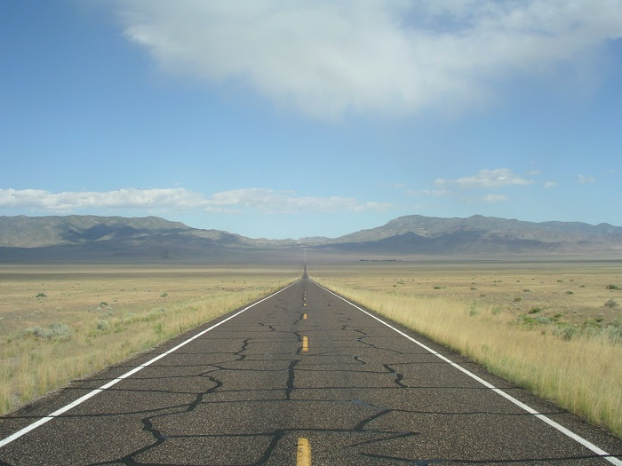

Title: Cycling across the U.S.
Date: 2015-11-26 17:39
Category: outdoors
Tags: cycling
Summary: One year, I got it in my head that I wanted to ride my bicycle across the country.  What follows is a description of my approach in the event that someone else is searching for information on this topic.  

One year, I got it in my head that I wanted to ride across the country.  I was several years removed from being an active cyclist but was experienced enough so that the prospect of such an undertaking wasn't daunting.  My only concerns were weather, mechanical problems, and logistics (food/hotels/water).  What follows is a description of my approach in the event that someone else is searching for information on this topic.  

# Details  

My approach was atypical.  Most folks camp and generally take their time, so most everyone I met was surprised by how little I was carrying.  I came from a racing background (amateur level but way too into it) and preferred going fast and doing bigger distances.  To realize these preferences, I had to travel as lightly as possible and spend more money.  Being out of cycling shape coupled with the big distances led to some physical problems (noted below under __Physical toll__).  

I suppose one could say that I traveled "ultralight," although I hesitate to use that term since I've read of riders carrying less.  

## Route  

I started inland in VA and ended inland in CA.  I had enough cycling experience in both start/end locations and wasn't interested in the "dip your wheel in both oceans" thing.  Much more appealing was traveling through the middle of the U.S.  

My route followed the [TransAmerica Trail](http://www.adventurecycling.org/routes-and-maps/adventure-cycling-route-network/transamerica-trail/) to Pueblo, CO and then switched to the [Western Express](http://www.adventurecycling.org/routes-and-maps/adventure-cycling-route-network/western-express/).  __Highly recommended__ maps are available from [Adventure Cycling](http://www.adventurecycling.org/).  These maps show what level of service is available in each town (hotel, gas station, etc.), which is incredibly useful.  

Total distance - 3200 miles  
Number of riding days - 30  
Number of rest days - 5  
Daily average excluding rest days - 105  
Minimum daily distance - 45 miles  
Maximum daily distance - 180 miles  

## Weather and timing

Timing is important since some of the mountain passes along the route can be closed due to snow.  The year I left was a heavy snowfall year and some passes had stayed closed into June.  I saw heavy amounts of snow on both sides of the road in early July when crossing into CA.  

Regardless of what direction you ride, the wind can be against you for days on end in the western, more open portion of the route.  Prevailing winds (aka [westerlies](https://suite.io/jon-plotkin/5xp02e9) in the U.S.) are directed from west to east, so conventional wisdom says to start in the west.  A rider who had done the route before told me of fighting the wind for days on the Western Express while heading __east__, which just emphasizes how locally variable the weather can be.  

Arriving to the Western Express portion of the route late in the year can also be problematic due to increased temperatures.  Furthermore, too late in the year and there can be flooding when rainstorms occur.  [Adventure Cycling](http://www.adventurecycling.org/) suggests finishing the Western Express portion by July.  Also, there can be flooding in the midwest approaching the Mississippi depending on the time of year.  

Tornados are a potential reality in some portions of the route.  I checked the weather pretty carefully every day but there's not much to do (other than lay in a ditch?) if you are caught without shelter nearby.  I took refuge in a church during a bad thunderstorm in KY that had at least one local heading to a friend's basement (the late-morning sky turned a strange brown color).  

The mountain passes and parts of the western states can be incredibly cold, even in late June.  I had trouble descending Monarch pass in CO because of cold hands and experienced an unbelievably cold morning in Utah that had me dismount and shiver until the sun got higher.  It's something I just accepted since the goal was to travel light.  Thankfully, cold weather wasn't a problem outside those two instances.  

I left in late May and arrived early July.  

## Budget  

I credit card camped (i.e., stayed in hotels) and ate in restaurants for dinner, which drove the budget up.  Relying on hotels heavily influenced how far I could ride in a day since there had to be a hotel where I finished.  Dinner was often expensive because I would order the same thing twice.  Away from big cities, hotels averaged significantly less.  

A large portion of my budget went to gear.  I had wheels custom built with a high spoke count to avoid a serious mechanical issue in the middle of nowhere.  If your rim cracks or the wheel otherwise fails you can be stuck in a town with no bike shop waiting for a shipment to arrive.  There aren't a lot of bike shops directly along the route.  

## Gear  

The following amount of items in a saddlebag on a smaller bike may be cumbersome (I had a 65cm frame).  

__Bicycle__  
- 2004 Cannondale R2000 with Ultegra group  
- custom made 700C wheels using DT Swiss parts  
- [Revelate Viscacha saddlebag](https://www.revelatedesigns.com/index.cfm?fuseaction=store.catalog&CategoryID=4&ProductID=1)  
- SKS Raceblade front/rear fenders with added 3M reflective tape  
- small saddle bag that one might normally have on a road bike  
- Specialized Roubaix Armadillo tires, 700x23/25c  
- Speedplay X2 pedals  

__Maintenance__  
- allen wrenches  
- big frame pump (to reach 100+ psi)  
- chain lube  
- chain tool (full size because I hate miniature ones)  
- leatherman  
- new chain and rear cassette halfway through  
- Park Tools tire boots (instead of a spare tire)  
- Schraeder to Presta adapter  
- spare spokes taped to frame  
- spare SRAM chain masterlink  
- tire levers, patch kit, two spare tubes  

__Clothes__  
- arm warmers  
- Keen closed-toe sandals  
- one pair of shorts  
- two cycling jerseys  
- two pairs of cycling shorts  
- two pairs of socks  
- two pairs of underwear  
- two small Sea-to-Summit dry bags  
- two t-shirts  
- windproof vest  

__Electronics__  
- camera/phone  
- flashing red LED rear light (always on, day or night)  
- Garmin Oregon GPS  
- handlebar light  
- iPad  
- rechargeable NiMH batteries and charger  
- SPOT satellite tracker  

__Misc__  
- DZ Nutz chamois cream  
- four water bottles  
- hydration backpack purchased in KS  
- small combination bike lock (I hardly used it)  
- sunscreen  
- toothbrush + small toothpaste tube  

I stored the paper maps on the iPad by taking pictures of them.  I also manually created the entire route in the Garmin mapping software and saved it in the GPS.  

All garments were made from wicking polyester.  Underwear/socks/shirts went into one of the drybags.  The other drybag contained electronics.  

Everything fit into the giant saddlebag, which predictably swayed slightly when pedalling while standing up.  I got used to it.  Once the trip was over I had to relearn how to ride standing up since the swaying compensation had become innate.  The sandals were strapped to the saddlebag/saddle.  

Every night in the hotel room I would hand wash the cycling clothes I wore that day in the tub.  I used a washing machine a few times.  

Two water bottles were stored in cages on the bike's frame.  Two water bottles were stored in rear jersey pockets.  I bought a hydration backpack in KS once services started to get more spread out.  Some Western Express stretches require you to ride ~100 miles without a gas station.  

At the end of every day I "checked-in" with the SPOT personal locator beacon.  It has a tracking feature which I did not use in order to conserve battery life (the SPOT used AAA Lithium ion batteries which I didn't feel like tracking down during the trip).  

# Characteristic road dangers of each state  

I really enjoyed the route for the most part.  Particularly the western Virginia portion because it's composed of mostly quiet and extremely scenic country roads.  However, it would be incorrect to say that it's a safe trip because different regions presented unique challenges out on the road.  

- __Kentucky__ - coal trucks, deep rumble strips + no shoulder, dogs  
- __Missouri__ - logging trucks, dogs  
- __Kansas__ - big rig trucks.  
- __Colorado__ - lots of RVs, campers, and in general, drivers that seemed to pass very closely  
- __Utah__ - rental RV vehicles  
- __Nevada__ - deep rumble strips on highway 50, serious water challenges due to spread-out gas stations  

Dogs were a problem because folks out in the rural areas do not have fences.  I met a local cyclist out for a ride in Kentucky who had pepper spray mounted to his handlebars.  The only time I was truly concerned was when a pack of dogs from a neighborhood in Missouri surrounded me and I couldn't yell them off (they eventually went away).  

[Big rig trucks](https://en.wikipedia.org/wiki/Semi-trailer_truck) had to be treated with respect.  There were tons of Kentucky coal trucks hauling loads in the eastern portion.  I was repeatedly told that the logging trucks in Missouri were unable to stop going downhill due to the heavy loads.  On the two-lane highway 96 in Kansas, very large trucks would unavoidably pass closely and their size/speed would displace such a huge volume of air that I would get pulled towards the truck.  People have [died](http://www.pressherald.com/2013/06/27/crash-report-cites-truck-draft-in-trek-across-maine-cyclists-death/) that way (getting sucked-in under the truck).  

My strategy was to just pull over if a truck was approaching from behind and there was oncoming traffic that would prevent them from moving over.  Maybe typical touring cyclists with heavier loads (full camping gear, paniers) are more stable and do not have the air-driven "suck-in" problem?  I didn't mind pulling over: Besides the safety aspect, the drivers of these trucks had jobs to do and I was just on vacation.  

RVs were nerve-wracking because while a big-rig truck is (presumably) driven by a professional, RV owners are probably everyday people like you and me.  Especially the drivers of the rental RVs.  This knowledge made me very careful when an RV was about to pass.  Sometimes, I just pulled over.  Also, the folks in the western states take things to a new level!  In Colorado and westward, I saw [triple towing](http://rv-roadtrips.thefuntimesguide.com/2010/02/rv_towing-2.php) for the first time (e.g., pickup truck towing a camper towing a boat).  

# Physical toll  

These things mainly happened because I wanted to do high mileage days without doing hardly any bike training before leaving.  The extra weight from gear made things worse than normal.  

- Aching quadriceps in the second through third weeks from riding my way into shape.  They weren't sore, they just ached.  I had to easy-pedal in the small ring for a while, which was frustrating.  It was a really weird feeling but eventually went away.  
- Severe neck pain from constantly checking behind me for traffic because I was too dumb to take a mirror.  While this became somewhat manageable, it prevented me from doing more long distance rides after the trip.  
- Numb big toes on each foot because my shoes fit poorly.  This persisted for a few months after the trip was over.  
- Aching palms when leaning on handlebars because I did not wear gloves.  This persisted for far less time than the numb toes.  

The neck pain was the worst and kept me from riding more once I was done.  It peaked in severity around the late second week and became manageable after the third week.  At its peak, the pain got to the point where I could no longer rotate my head and look behind me for traffic.  There are some simple solutions that I ignored:  

- Ride less each day (no thanks).  
- Ride more before leaving so that the neck muscles are more prepared (I went on about a half dozen rides to wake up the legs).  
- Use a touring bike or raise the stem to make the back more upright.  
- Take a simple handlebar mirror to avoid constantly turning around and looking for traffic.  

# Benefits  

- Extreme patience with things like waiting in line, traffic, etc.  
- Newfound appreciation for remote areas of states that I was unlikely to ever visit.  
- Ability to grind away in the big ring for 12+ hours and climb forever.  _Tradeoff:_ complete inability to sprint, which felt really weird.  

# What I would do differently  

- Take a smaller tablet.  
- Take a handlebar mirror.  
- Wear padded gloves.  
- Spend time finding better-fitting shoes.  
- Try to incorporate a [frame bag](https://www.revelatedesigns.com/index.cfm/store.catalog/frame-bags/TangleFrameBag) so the saddle bag wouldn't be so large.  
- Train more beforehand so that big days (~200 miles) could be done earlier in the trip.  
- Figure out how to reliably inflate tires using a gas station air pump.  I imagine this is kinda tricky because it would be easy to overinflate.  I had trouble getting the frame pump to put out 110+ psi.  Low tire pressure on skinny road tires while carrying extra gear = a slow bike.  
- Never turn down water in the desert (I did that once after miscalculating and really regretted it).  

# Images  

    <ul class="gridderB">
        <li class="gridder-list" data-griddercontent="#gridderB-content-1">
        	
        </li>
        <li class="gridder-list" data-griddercontent="#gridderB-content-2">
        	
        </li>
        <li class="gridder-list" data-griddercontent="#gridderB-content-3">
        	
        </li>
        <li class="gridder-list" data-griddercontent="#gridderB-content-4">
        	
        </li>
        <li class="gridder-list" data-griddercontent="#gridderB-content-5">
        	
        </li>
        <li class="gridder-list" data-griddercontent="#gridderB-content-6">
        	
        </li>
        <li class="gridder-list" data-griddercontent="#gridderB-content-7">
        	
        </li>
        <li class="gridder-list" data-griddercontent="#gridderB-content-8">
        	
        </li>
        <li class="gridder-list" data-griddercontent="#gridderB-content-9">
        	
        </li>
        <li class="gridder-list" data-griddercontent="#gridderB-content-10">
        	
        </li>
        <li class="gridder-list" data-griddercontent="#gridderB-content-11">
        	
        </li>
        <li class="gridder-list" data-griddercontent="#gridderB-content-15">
            
        </li>
        <li class="gridder-list" data-griddercontent="#gridderB-content-12">
        	
        </li>
        <li class="gridder-list" data-griddercontent="#gridderB-content-13">
        	
        </li>
        <li class="gridder-list" data-griddercontent="#gridderB-content-14">
        	
        </li>
    </ul>

    

        

            

                
            

            

                
Some roads are in the middle of nowhere.

            

        

    

    

        

            

                
            

            

                
Some roads are four lane highways.

            

        

    

    

        

            

                
            

            

                
Drying washed clothes.  Since the flash was on, you can see the 3M reflective tape I added to the fenders.  It's difficult to see, but the small combination lock is wrapped around the head tube.

            

        

    

    

        

            

                
            

            

                
Ohio River ferry crossing

            

        

    

    

        

            

                
            

            

                
Bridge under construction.

            

        

    

    

        

            

                
            

            

                
While everyone I met was using paper maps to navigate, I was using a GPS.  This was really nice and only failed me once.  I was riding along in Kansas and noticed traffic had pretty much disappeared.  In fact, the road became pretty desolate, but I kept going because the GPS said to.  Eventually, the road completely dead-ends into grass.  The Garmin mapping software was unaware a new road had been constructed off to the right.

            

        

    
 
    

        

            

                
            

            

                
One of the more obvious signs along the route.

            

        

    

    

        

            

                
            

            

                
Eastern Colorado meets western Kansas.

            

        

    

    

        

            

                
            

            

                
I saw maybe five cars during the 5+ hours I was on this stretch in Utah.

            

        

    

    

        

            

                
            

            

                
Nevada/Utah area.  I think everyone takes a picture like this.  One goes straight ahead for 20 miles, climbs a mountain, decends mountain, repeat ...  This is one of the longest stretches without services (about 80 miles).

            

        

    

    

        

            

                
            

            

                
One runs into other cyclists riding the TransAmerica Trail.  I probably saw at least a dozen.  Everyone I met was camping.

            

        

    

    

        

            

                
            

            

                
Self portrait.

            

        

    

    

        

            

                
            

            

                
Road surfaces of the U.S., part I.  Different areas had different colors to the road, which I assume was indicative of whatever local quarry was used.  (Yes, things do get boring.)

            

        

    

    

        

            

                
            

            

                
Road surfaces of the U.S., part II.

            

        

    

    

        

            

                
            

            

                
Road surfaces of the U.S., part III.

            

        

    

# Anecdotes  

- I was climbing a mountain pass in eastern Kentucky that wouldn't seem to end.  Eventually a driver pulled up in an old Camry to say hello.  After a brief exchange of formalities through the passenger side window, he says "hold on."  We proceed to continue making idle conversation as he pulls me up the mountain for about 5 minutes (I'm hanging onto the car while riding).  He was a super nice guy and even offered me a beer.  This was a narrow, winding road in Appalachia and I almost went off the edge when a car approached us from the opposite direction.  While I would have made it over the pass regardless, this kind gesture was an amazing psychological boost.  
- The Ohio river is crossed at Cave-In-Rock, IL.  While there is no real story to go with this one, it was a unique experience to ride my bike onto a ferry, cross the river, and then ride off.  I guess it doesn't take much to entertain me.  
- Crossing the Mississippi river at Chester, IL was nerve wracking.  There is a shoulder on the bridge but it's elevated by a foot so it's impossible to move over for traffic.  Vehicles are moving quickly and the Mississippi is a __wide__ river.  I asked a trooper if he had any crossing-by-bike advice, and he didn't.  All he said was, "maybe you'll get them to actually slow down," which wasn't exactly encouraging.  So I waited for a big gap and went all-out.  I don't know how, but I'd chosen perfectly since no traffic was in my lane.  I hadn't escaped the bridge for 30 seconds when big rigs come flying by.  It was one of the more stressful traffic situations of the trip.  
- I'm riding along in Missouri when all of a sudden I'm greeted with a "road closed" sign.  I mean, this is a pretty jarring experience because no other alternative really comes to mind.  I don't live here, I've never been here, and a detour would probably add 20 miles.  Instead of turning back (and taking what route?), I continue forward to see just how "closed" this road is.  Turns out, very closed.  See, the state of Missouri decided to spend money on rural bridges the summer I went on my trip.  In this case, the workers were replacing a bridge spanning a 30ft creek.  I dismount, walk over, and am eventually waived over this partially completed bridge.  This scenario repeated itself twice.  
- You see all kinds of nice and interesting people along the route.  I met a couple riding from California to Colorado to their own wedding.  One young guy had his dog with him on a trailer, but had to rent a car and take the dog home because of the heat.  Another rider was on a singlespeed bike.  Also, there's all kinds of other people just crossing the U.S. at any given time via other means.  Groups of touring motorcyclists are a common sight (I think they're as concerned/respectful of trucks and wind as cyclists).  Finally, there was one person I saw only briefly because I was descending fast.  I heard it was a visitor from Japan on some type of pedaling machine (I've already forgotten; a three wheeled cart maybe?) with a HUGE basket just filled with stuff.  
- I found it really hard to carry enough water in Nevada.  Unlike an east coast "hot," a Nevada hot doesn't drench your clothes in sweat.  Instead, you're constantly losing fluid while staying dry.  Well, one day I had miscalculated my fluid intake and was getting in serious trouble towards the end.  I was less than 15 miles from my destination but needed to make it up one final 20+ minute climb.  The problem was that I was developing a headache and pretty much out of water.  You can't just pull over at a gas station because this is rural Nevada -- there really aren't any outside of town.  So I'm climbing up the pass, deciding if I need to pull over and waive down a car, when I see an older gentleman already pulled over.  He's standing by his car, arm outstretched holding a water bottle, and shouting "domestique!"  This guy was scouting locations to do a bike trip with his own son and just happened to be there when I needed help the most.  It was incredible.  
- A Days Inn in Montrose, Colorado had this laminated message on its beds.  One can find variations of this "Stranger within our gates" message in other places, but I had never seen it until then.  
> Because this is a human institution to serve people, we hope that God will grant you peace and rest while you are under our roof.  May those that you love be near you in your thoughts and dreams.  Even though we may not get to know you, we hope that you will be comfortable and happy as if you were in your own house.  May the business that brought you our way prosper.  May every call you make and every message you receive add to your journey.  We are all travelers.  From "birth to death" we travel between eternities.  May these days be pleasant for you, profitable for society, helpful for those you meet, and a joy to those we know and love you best.  

# Closing  

I can't say that cycling across the U.S. is the safest thing in the world to do, but it certainly is one of the best ways to appreciate the landscape.  I went as fast as possible, but that made it fun for me.  Others may enjoy camping and spending time in the national parks along the route.  Regardless of how one approaches such a trip, he/she is unlikely to experience anything similar ever again.  

# Useful resources  

- [Adventure Cycling](http://www.adventurecycling.org) (maps, route information, forums)  
- [bicycletouring subreddit](https://www.reddit.com/r/bicycletouring/) (riders post their travel logs here, which is super useful)  
- [crazyguyonabike](http://www.crazyguyonabike.com/)  

