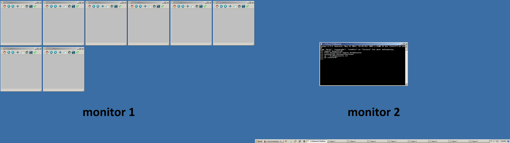

Title: Creating a grid of matplotlib figures
Date: 2015-12-13 16:49
Category: misc
Tags: python
Summary: Whenever I'm analyzing a dataset, I tend to create lots of different plots (e.g., y-axis transforms, different x-variables, etc.).  Usually, it's a lot more instructive to view all these plots at once so that differences can be readily viewed.  Since it rapidly becomes tedious to manually position/resize the automatically-created plotting windows, I created a tool called [__matplotgrid__](http://github.com/h-gens/matplotgrid) that tiles the windows.  

Whenever I'm analyzing a dataset, I tend to create lots of different plots (e.g., y-axis transforms, different x-variables, etc.).  Usually, it's a lot more instructive to view all these plots at once so that differences can be readily viewed.  Since it rapidly becomes tedious to manually position/resize the automatically-created plotting windows, I wrote a tool called [__matplotgrid__](http://github.com/h-gens/matplotgrid) that tiles the windows.  Below is a demonstration of what the tiling looks like.  

  
> from matplotgrid import GridCreator; gc = GridCreator(); gc.create(8)  

This tool will be especially useful for those who work within the Spyder IDE (<https://winpython.github.io/>) and execute scripts via the Spyder console (a MATLAB-like experience).  

Arguments  
-------------

[__matplotgrid__](http://github.com/h-gens/matplotgrid) is controlled by four main arguments: 

- Number of rows in the grid.  
- Number of columns in the grid.  
- The monitors to use.  
	- If this is an integer, then it represents the monitor at which the tiling begins.  
	- If this is a list of integers, then tiling will be constrained to the monitors contained in the list.  
- Number of figures to create.  
	- If this is an integer, then N figures are created numbered 1 through N.  
	- If this is a list of integers of length N, then N figures are created numbered according to the content of the list.  

Behavior
-------------

- [__matplotgrid__](http://github.com/h-gens/matplotgrid) automatically detects the number of monitors and their resolutions through the [__screeninfo__](https://github.com/rr-/screeninfo) module.  
- Unless otherwise instructed by an argument, the grid is first constructed on the left-most monitor.  The first figure is created in the top-left of that first monitor.  If enough figures have been created such that the right-most monitor has been filled, then figure creation wraps back around and begins again on the left-most monitor.  
- Integer row/columns are the most appropriate, but fractional values are allowed (the grid will just extend off-screen).  
- The same row/column settings are applied to each monitor, meaning figure size will vary between monitors with different resolution.  

> _NOTE_: [__matplotgrid__](http://github.com/h-gens/matplotgrid)'s goal is to pack the figures as close as possible.  How successful this is depends on the operating system and theme because these determine the border surrounding the figure.  The largest contribution to the border is the titlebar (in Windows this contains the window's title and the minimize/maximize/close icons).  I chose default values that reflected the border for the Windows 7 "Aero" theme.  These defaults are configurable via the <code>prop</code> kwarg when initializing the GridCreator class.  

Suggestions  
-------------

- As figures are made smaller, the margins (where axis labels are written) are not automatically adjusted.  The easiest solution is to call matplotlib.pyplot.tight_layout() on each figure.  
- Figures will only be created automatically if interactive mode has been enabled with <code>matplotlib.pyplot.ion()</code> or <code>matplotlib.interactive(True)</code>.  My startup script for Spyder is spyderlib\scientific_startup.py, which turns interactive mode on automatically.  

Usage  
-------------

Example 1  

	from matplotgrid import GridCreator  
	# Define a grid with 3 rows and 6 columns.  
	gc = GridCreator(3, 6)  
	# Create 8 figures.  
	gc.create(8)  

Example 2  

	:::python  
	# create four figures, numbered 9, 10, 11, 12.  
	gc.create([9, 10, 11, 12])  

Example 3  

	:::python  
	# Create four figures on the second monitor from left.
	gc = GridCreator(3, 6, 1)  
	gc.create(4)  

Example 4  

	:::python  
	# Create twenty-two figures but constrain all figures to the first
	# monitor from left.
	gc = GridCreator(3, 6, [0])  
	gc.create(22)  

The repository can be found [here](http://github.com/h-gens/matplotgrid).  
