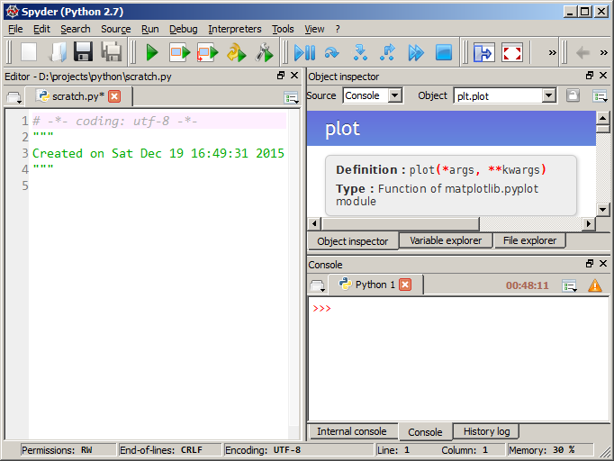
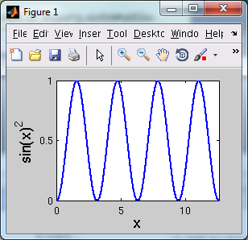
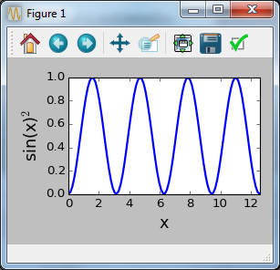

Title: Python as a MATLAB alternative  
Date: 2016-02-12 15:25  
Category: misc  
Tags: python  
Summary: Python can be used as a MATLAB alternative for scientific analysis.  This post contains installation advice and example code in both languages.  

I used MATLAB heavily throughout graduate school for analysis of measured data.  I parsed text files, created plots for publication, performed optimization, and created GUIs when needed.  There really wasn't anything that I felt the tool couldn't do with respect to my needs at the time.  I happily continued using MATLAB upon joining my first company until one day we ran out of licenses.  At that moment I realized I'd locked myself into a tool whose limited availability was directly related to my ability to do work.  Fortunately for me, this came at a point where several established alternatives already existed, and I settled upon Python.  

For a Windows user, recreating a MATLAB-like experience is immediately possible by downloading [WinPython](https://winpython.github.io/) and using the [Spyder IDE](https://github.com/spyder-ide/spyder).  Below is a quick screenshot of the IDE on my computer.  Any MATLAB user should quickly appreciate the similarity.  

  

Details  
--------------

Scientific Python is enabled by the "holy trinity" of three Python packages:  

- [numpy  ](http://www.numpy.org/)
- [matplotlib](https://www.scipy.org/)  
- [scipy](http://matplotlib.org/)  

numpy adds fast arrays/matrices to Python and is the foundation for scipy, which has higher-level mathematical/statistical tools such as curve fitting.  matplotlib provides the plotting interface.  There are __many__ other packages available for scientific computing.  

If you were able to learn MATLAB, then you are capable of learning Python.  Having been subjected to many programming languages, I can honestly say that Python was the easiest to learn.  There are many high-quality tutorials online, and any question a beginner can think of probably already has an answer on [stackoverflow](https://stackoverflow.com/questions/tagged/python?sort=frequent&pageSize=15).  Python can be taken anywhere, and I often open up a Python terminal to evaluate expressions instead of losing my sanity using Windows Calculator.  

Installation  
--------------

For a Windows user, the easiest way to get started is to download and install [WinPython](https://winpython.github.io/) (WinPython comes with Python, so no other downloads are needed).  "Installation" just unarchives the contents to a directory of your choosing, which means you do not need administrator rights to install (it's portable).  Since it's localized/portable, it won't interfere with a preexisting Python installation.  After installation, navigate to the created directory and run Spyder.  

The reason WinPython is so large is that it comes with lots of other packages that are useful for scientific analysis.  An alternative is to use [Python(x,y)](https://python-xy.github.io/), but it has some limitations: it's not portable, it's still on Python 2.7, and the included version of Python is not 64bit.  Some interesting history regarding WinPython and Python(x,y) can be read [here](http://sourceforge.net/p/winpython/wiki/Roadmap/).  

A Linux user has it a little easier and can install numpy/scipy/matplotlib from the command line.  <https://www.scipy.org/install.html>

Suggestions for Spyder  
--------------

- If you experience [this bug](https://github.com/spyder-ide/spyder/issues/1831) that causes the user to have to press "run" multiple times, then the solution is to use WinPython 2.7 or just use the IPython console.  By default, plots created in the IPython console are displayed inline, which can be changed in Tools -> Preferences -> IPython Console -> Graphics tab -> Backend.  

- If you're new to Python, then it is helpful to turn on automatic help information.  In WinPython 3.x, this is in Tools -> Preferences -> Object inspector -> Automatic connections.  It's enabled automatically in the version of Spyder bundled in my 2.7 version of Python(x,y) (find in in Tools -> Preferences -> Console -> Introspection tab).  

- In MATLAB, figures appear automatically upon typing <code>figure(1)</code>.  To replicate this behavior, one must enable matplotlib's "interactive" mode.  One can either add <code>import matplotlib; matplotlib.interactive(True)</code> to each script, or specify a Spyder startup script such as spyderlib\scientific_startup.py via Tools -> Preferences -> Console (or IPython console).  

- Regardless if one uses MATLAB or matplotlib, it becomes annoying to move/resize numerous figures created by a script.  [matplotgrid](https://h-gens.github.io/creating-a-grid-of-matplotlib-figures.html) is a tool I created for arranging multiple figures into a grid.  This is actually something I previously did in MATLAB but brought over to Python since it was so useful.  

Plotting examples  
--------------

The following code blocks accomplish the same thing: they demonstrate how one would plot a squared sinusoid.  The first example is in MATLAB and the second is in Python.  The figures from both blocks are shown.  

MATLAB example:  

	:::matlab  
	N = 100  
	L = 4 * pi  
	dx = L / (N - 1)  
	x = 0:dx:L  
	y = sin(x).^2  
	figure(1)  
	clf()  
	plot(x, y, 'b-', 'LineWidth', 2)  
	xlabel('x', 'FontSize', 16)  
	ylabel('sin(x)^2', 'FontSize', 16)  
	axis([0, 4 * pi, 0, 1])  

  

Python example:  

	:::python  
	import matplotlib.pyplot as plt  
	import numpy as np  
	N = 100  
	L = 4 * np.pi  
	x = np.linspace(0, L, N)  
	y = np.sin(x) ** 2  
	plt.figure(1)  
	plt.clf()  
	plt.plot(x, y, 'b-', linewidth=2)  
	plt.xlabel('x', fontsize=16)  
	plt.ylabel('sin(x)$^2$', fontsize=16)  
	plt.axis([0, 4 * np.pi, 0, 1])  
	plt.tight_layout()  

  
> One could use <code>plt.xticks([0, 5, 10])</code> and <code>plt.yticks([0, 0.5, 1])</code> to make them even more similar.  
